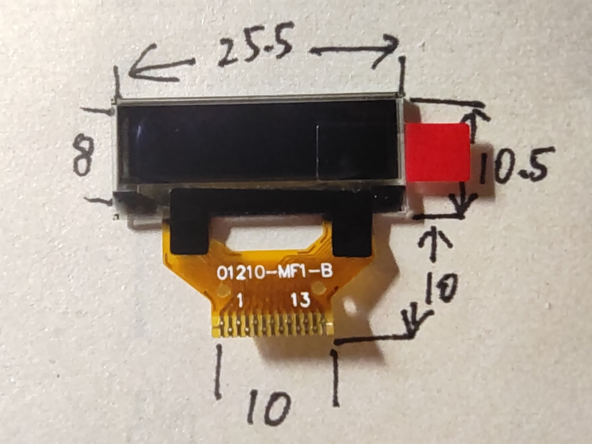
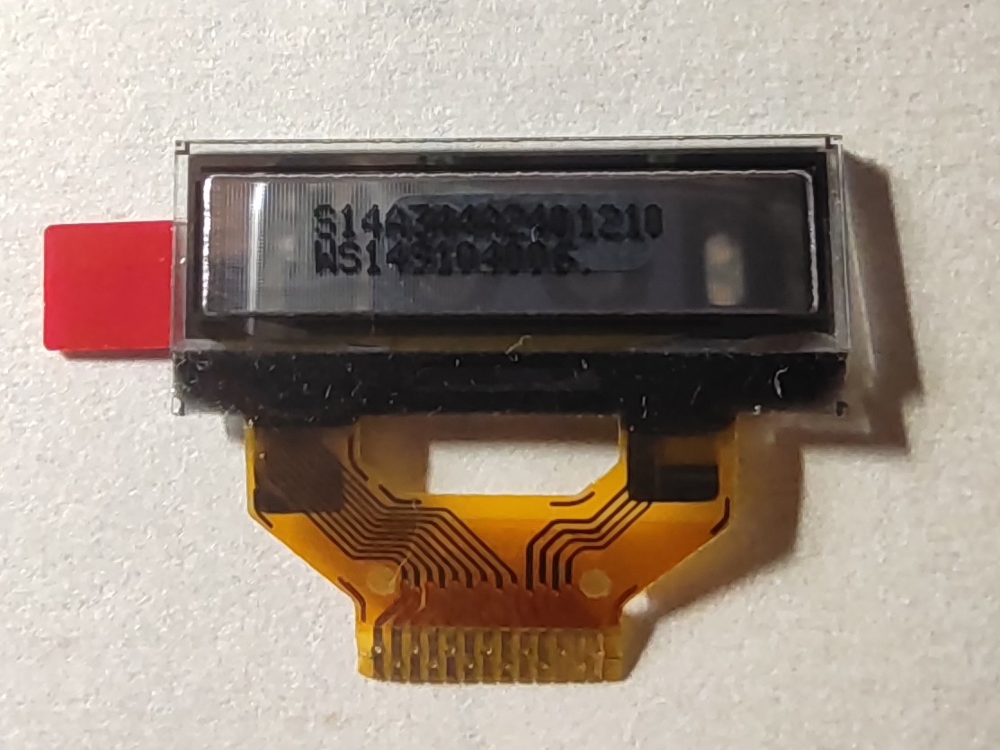
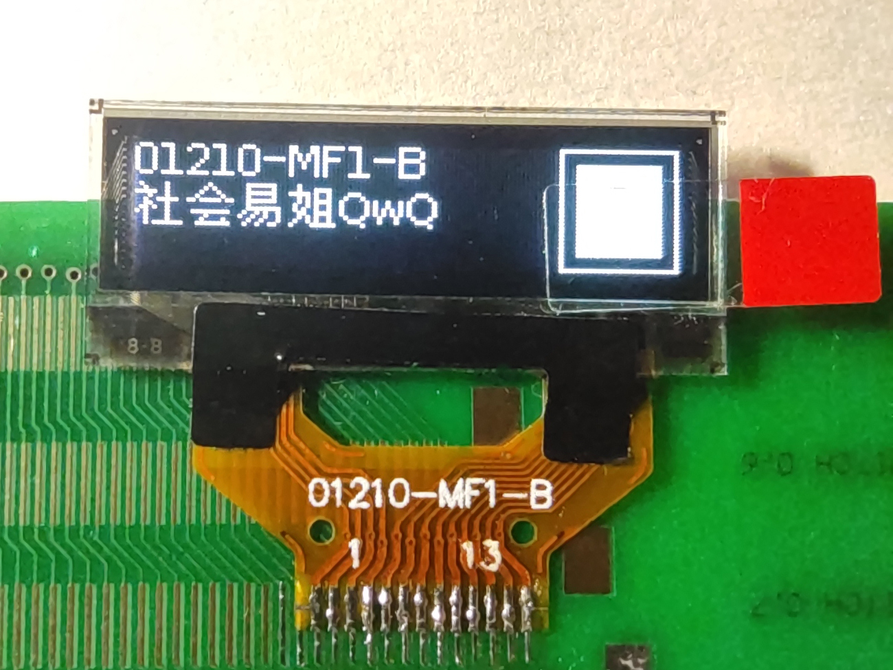
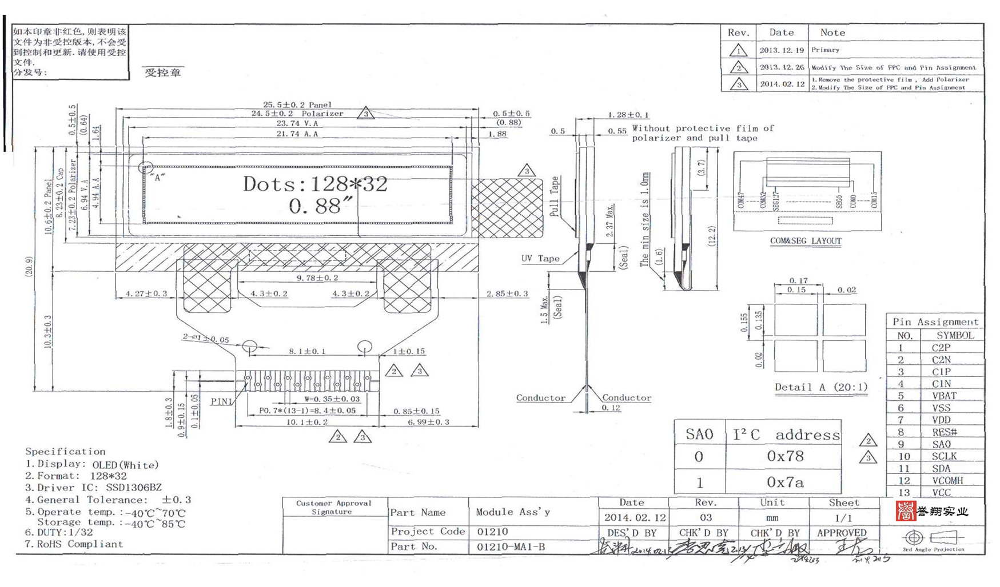

# 01210-MF1-B

## 参数

| 参数     | 属性                 |
| -------- | -------------------- |
| 类型     | 单色OLED点阵屏面板   |
| 分辨率   | 128x32               |
| 尺寸     | 25.5mm x 10.5mm      |
| 控制器   | SSD1306              |
| 接口     | I2C                  |
| 有无背光 | -                    |
| 工作电压 | 3.3V                 |
| 备注     | 扫描起始行需设置为32 |

## 正面

## 背面

## 测试

## I2C地址选择

| SA0  | 地址 |
| ---- | ---- |
| 0    | 0x78 |
| 1    | 0x7A |

## 引脚定义

| 序号（FPC标） | 定义                 |
| ------------- | -------------------- |
| 1             | C2P                  |
| 2             | C2N                  |
| 3             | C1P                  |
| 4             | C1N                  |
| 5             | VBAT（逻辑部分电源） |
| 6             | GND                  |
| 7             | VDD（逻辑部分电源）  |
| 8             | RST                  |
| 9             | SA0                  |
| 10            | SCL                  |
| 11            | SDA                  |
| 12            | VCOMH                |
| 13            | VCC（屏幕驱动电源）  |

## 原厂资料

