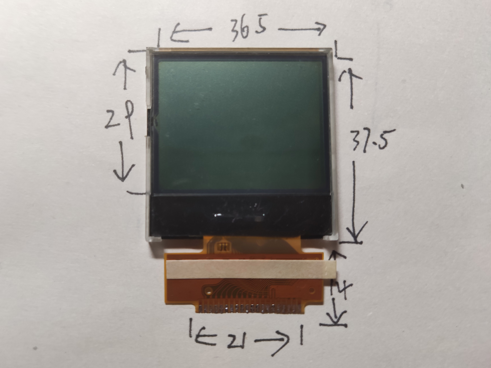
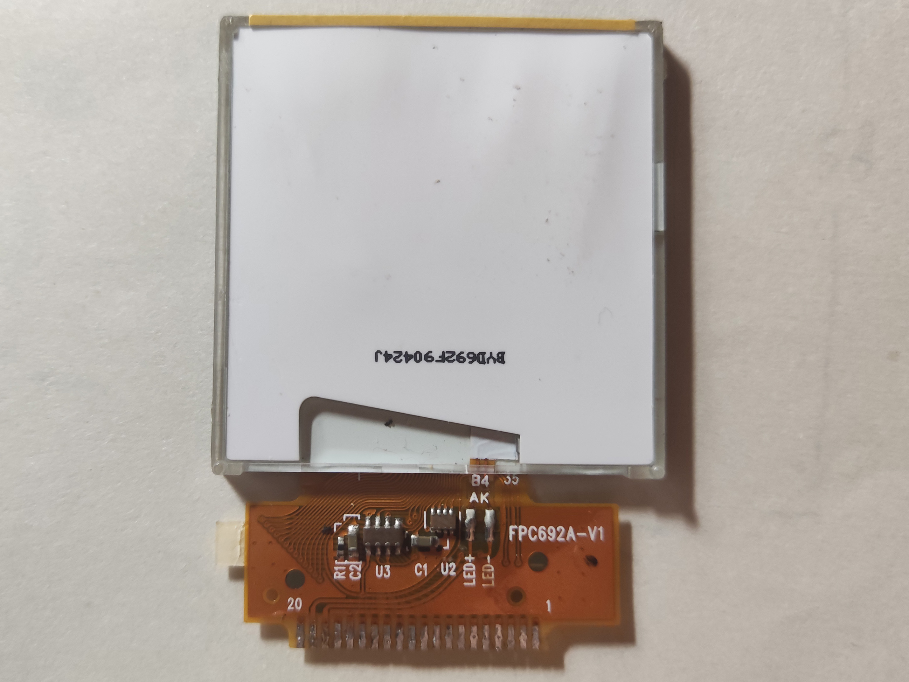
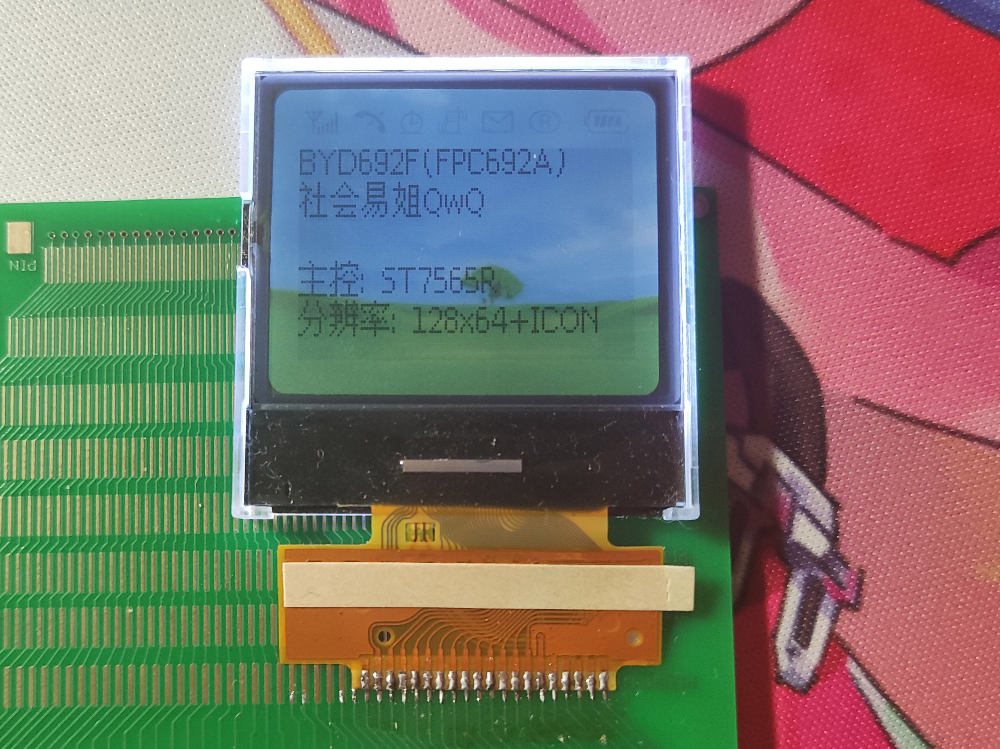
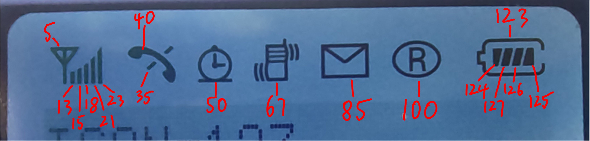

# BYD692F(FPC692A)

## 参数

| 参数     | 属性              |
| -------- | ----------------- |
| 类型     | 单色STN点阵屏面板 |
| 分辨率   | 128x64+ICON       |
| 尺寸     | 36.5mm x 37.5mm   |
| 控制器   | ST7565R           |
| 接口     | 6800 8-bit并口    |
| 有无背光 | 有                |
| 工作电压 | 5V                |
| 备注     | -                 |

## 正面

## 背面

## 测试

## ICON码表

## 引脚定义

| 序号（FPB标） | 定义 |
| ------------- | ---- |
| 1             | N/C  |
| 2             | CS   |
| 3             | RST  |
| 4             | A0   |
| 5             | R/W  |
| 6             | EN   |
| 7             | D0   |
| 8             | D1   |
| 9             | D2   |
| 10            | D3   |
| 11            | D4   |
| 12            | D5   |
| 13            | D6   |
| 14            | D7   |
| 15            | VCC  |
| 16            | GND  |
| 17            | N/C  |
| 18            | LED+ |
| 19            | LED- |
| 20            | N/C  |

​	