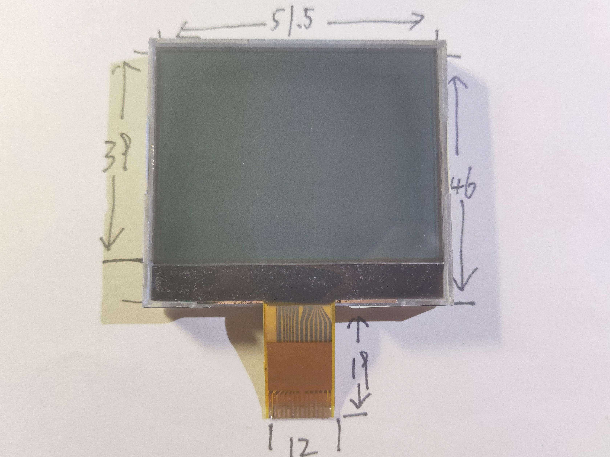
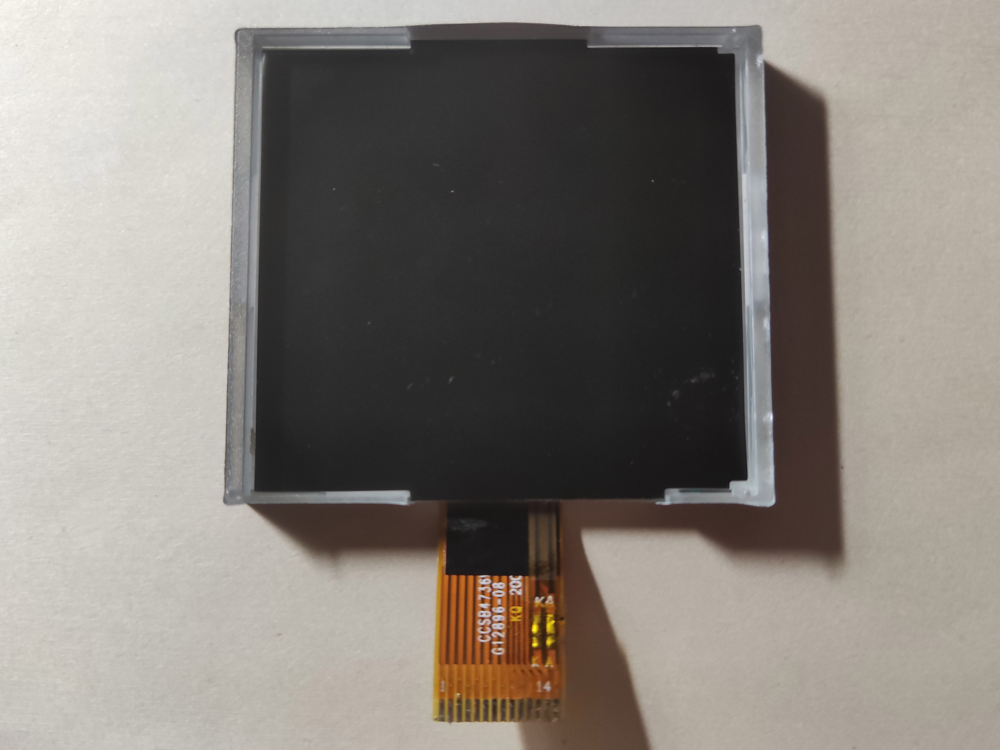
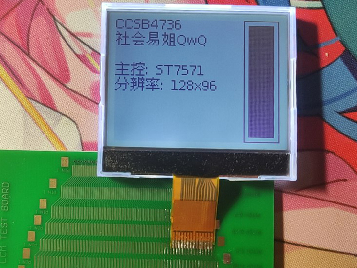

# CCSB4736W(G12896-08)

## 参数

| 参数     | 属性               |
| -------- | ------------------ |
| 类型     | 4灰度STN点阵屏面板 |
| 分辨率   | 128x96x2           |
| 尺寸     | 51.5mm x 46mm      |
| 控制器   | ST7571             |
| 接口     | 8-bit SPI          |
| 有无背光 | 有                 |
| 工作电压 | 3.3V               |
| 备注     | -                  |

## 正面

## 背面

## 测试

## 引脚定义

| 序号（FPC标） | 定义 |
| ------------- | ---- |
| 1             | CS   |
| 2             | RST  |
| 3             | A0   |
| 4             | SCL  |
| 5             | SDA  |
| 6             | VCC  |
| 7             | GND  |
| 8             | VM0  |
| 9             | V0   |
| 10            | XV0  |
| 11            | VD1  |
| 12            | VG   |
| 13            | LED- |
| 14            | LED+ |
