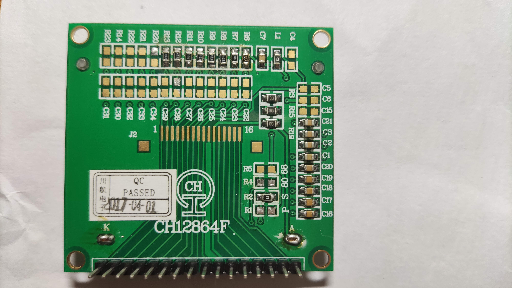
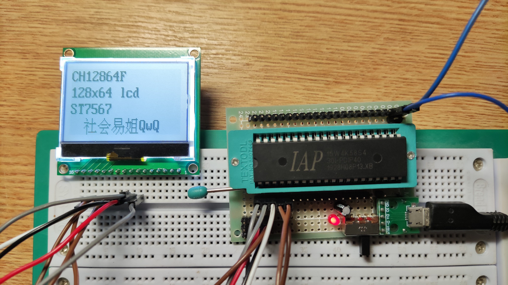

# CH12864F

## 参数

| 参数     | 属性                                              |
| -------- | ------------------------------------------------- |
| 类型     | 单色STN点阵屏模组                                 |
| 分辨率   | 128x64                                            |
| 尺寸     | 54mm x 50mm（PCB）                                |
| 控制器   | ST7567                                            |
| 接口     | 6800 8-bit并口 8080 8-bit并口 8-bit SPI |
| 有无背光 | 有                                                |
| 工作电压 | 3.3V                                              |
| 备注     | -                                                 |

## 正面

## 背面

## 测试

## 接口选择

| 接口模式       | R1   | R2   | R4   | R5   |
| -------------- | ---- | ---- | ---- | ---- |
| 6800 8-bit并口 | √    |      |      | √    |
| 8080 8-bit并口 | √    |      | √    |      |
| 8-bit SPI      |      | √    | \*   | \*   |

## 引脚定义

| 序号（PCB标） | 定义      |
| ------------- | --------- |
| 1             | D0        |
| 2             | D1        |
| 3             | D2        |
| 4             | D3        |
| 5             | D4        |
| 6             | D5        |
| 7             | D6（SCL） |
| 8             | D7（SDA） |
| 9             | VCC       |
| 10            | GND       |
| 11            | LED+      |
| 12            | CS        |
| 13            | RST       |
| 14            | A0        |
| 15            | WR（R/W） |
| 16            | RD（E）   |