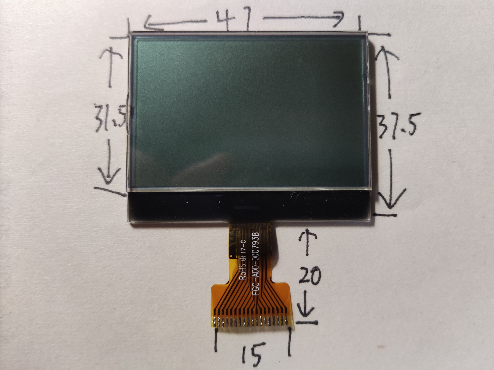
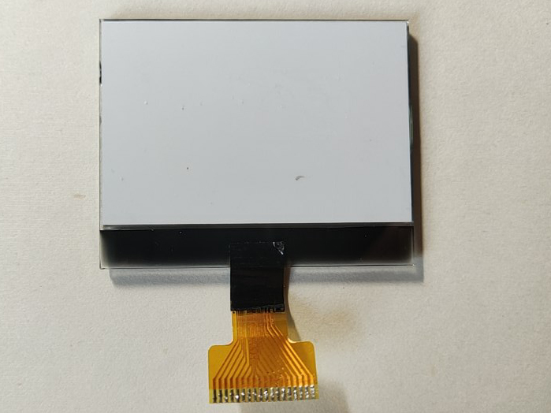
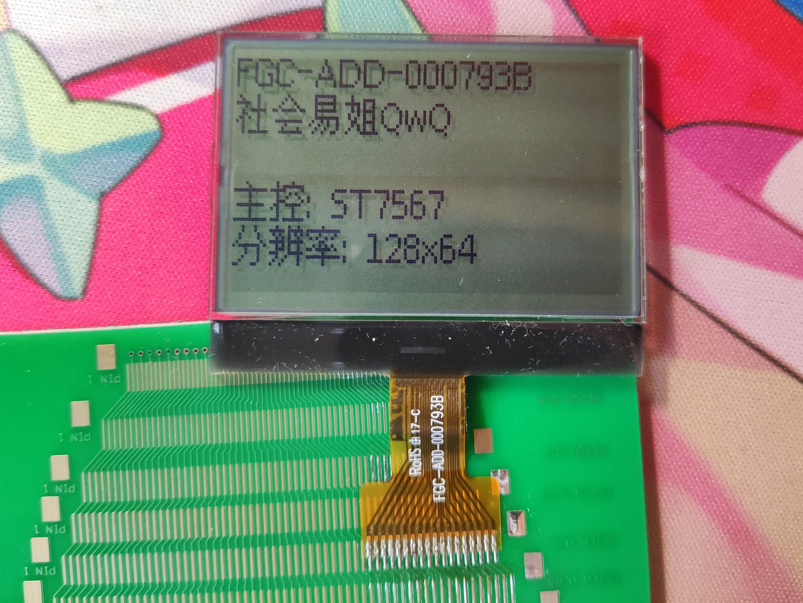

# FGC-ADD-000793B

## 参数

| 参数     | 属性                                      |
| -------- | ----------------------------------------- |
| 类型     | 单色STN点阵屏面板                         |
| 分辨率   | 128x64                                    |
| 尺寸     | 47mm x 37.5mm                             |
| 控制器   | ST7567                                    |
| 接口     | 8080 8-bit并口                            |
| 有无背光 | 无                                        |
| 工作电压 | 3.3V                                      |
| 备注     | 扫描起始行需设置为32 列偏移需设置为1 |

## 正面

## 背面

## 测试

## 引脚定义

| 序号（显示面从左至右） | 定义 |
| ---------------------- | ---- |
| 1                      | VG   |
| 2                      | XV0  |
| 3                      | V0   |
| 4                      | GND  |
| 5                      | VCC  |
| 6                      | D7   |
| 7                      | D6   |
| 8                      | D5   |
| 9                      | D4   |
| 10                     | D3   |
| 11                     | D2   |
| 12                     | D1   |
| 13                     | D0   |
| 14                     | RD   |
| 15                     | WR   |
| 16                     | A0   |
| 17                     | RST  |
| 18                     | CS   |