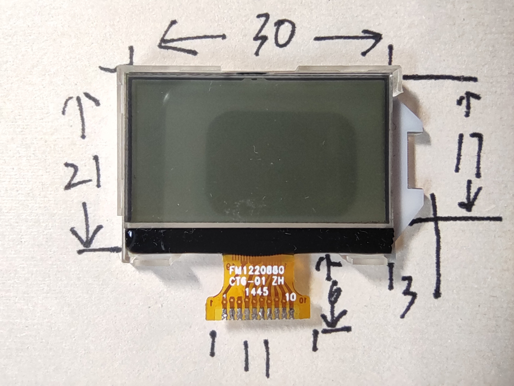
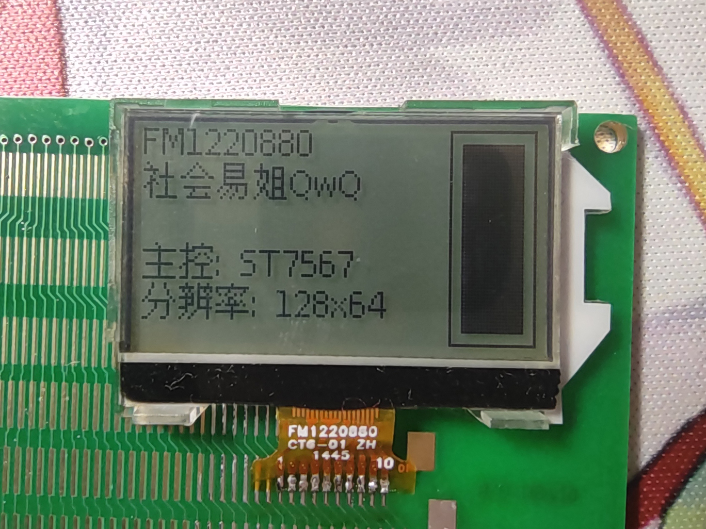

# FM1220880

## 参数

| 参数     | 属性              |
| -------- | ----------------- |
| 类型     | 单色STN点阵屏面板 |
| 分辨率   | 128x64            |
| 尺寸     | 30mm x 21mm       |
| 控制器   | ST7567            |
| 接口     | 8-bit SPI         |
| 有无背光 | 无                |
| 工作电压 | 3.3V              |
| 备注     | -                 |

## 正面

## 背面

## 测试

## 引脚定义

| 序号（FPC标） | 定义 |
| ------------- | ---- |
| 1             | V0   |
| 2             | N/C  |
| 3             | N/C  |
| 4             | GND  |
| 5             | VCC  |
| 6             | SDA  |
| 7             | SCL  |
| 8             | A0   |
| 9             | RST  |
| 10            | CS   |