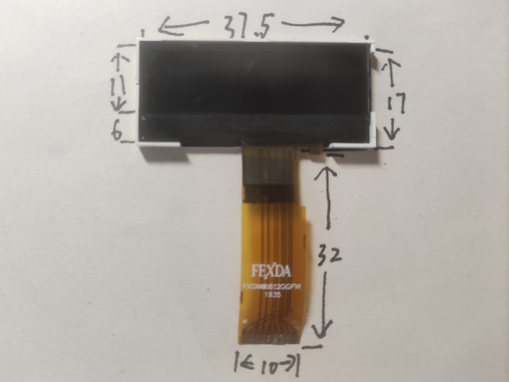
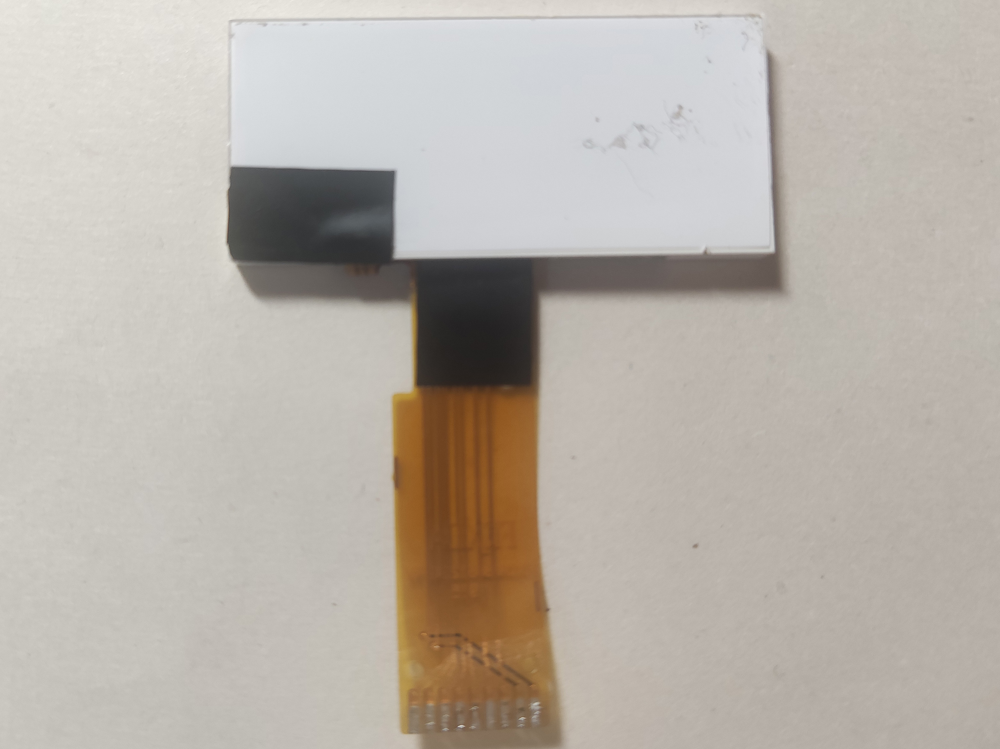
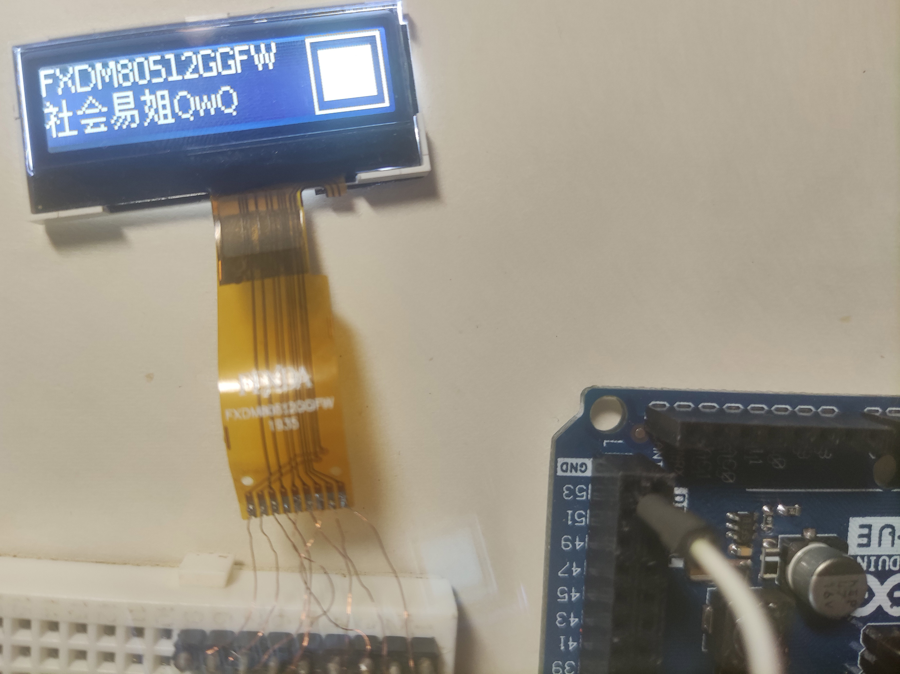

# FXDM80512GGFW

## 参数

| 参数     | 属性                               |
| -------- | ---------------------------------- |
| 类型     | 单色STN点阵屏面板                  |
| 分辨率   | 128x24                             |
| 尺寸     | 37.5x17                            |
| 控制器   | ST7567                             |
| 接口     | 8-bit SPI                          |
| 有无背光 | 有                                 |
| 工作电压 | 3.3V                               |
| 备注     | 需设置垂直及水平镜像，页偏移+1page |

## 正面

## 背面

## 测试

## 引脚定义

| 序号（显示面从右至左） | 定义 |
| ---------------------- | ---- |
| 1                      | CS   |
| 2                      | RST  |
| 3                      | A0   |
| 4                      | SCL  |
| 5                      | SDA  |
| 6                      | VCC  |
| 7                      | GND  |
| 8                      | LED+ |
| 9                      | LED- |