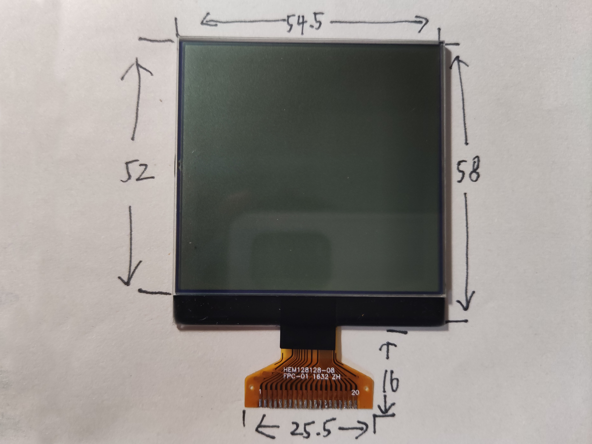
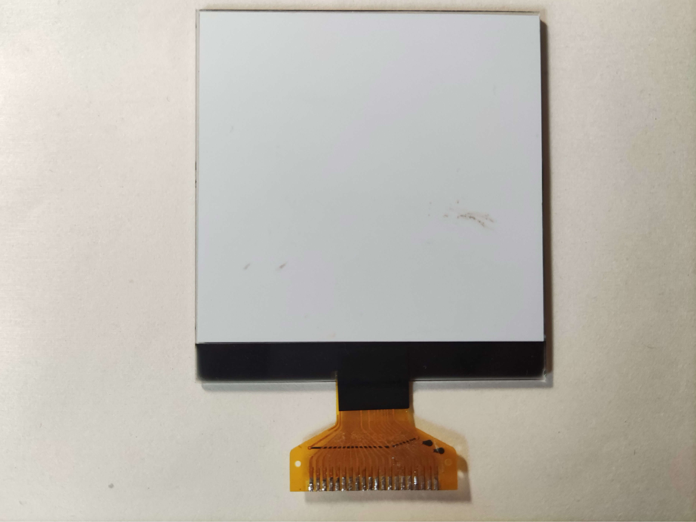
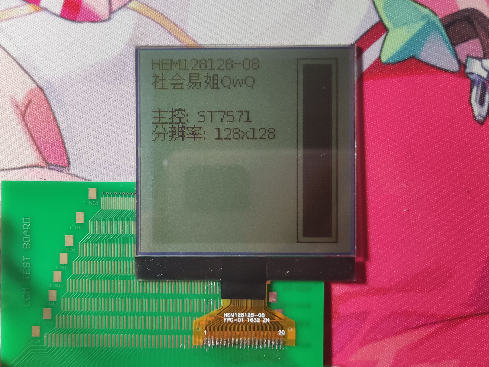
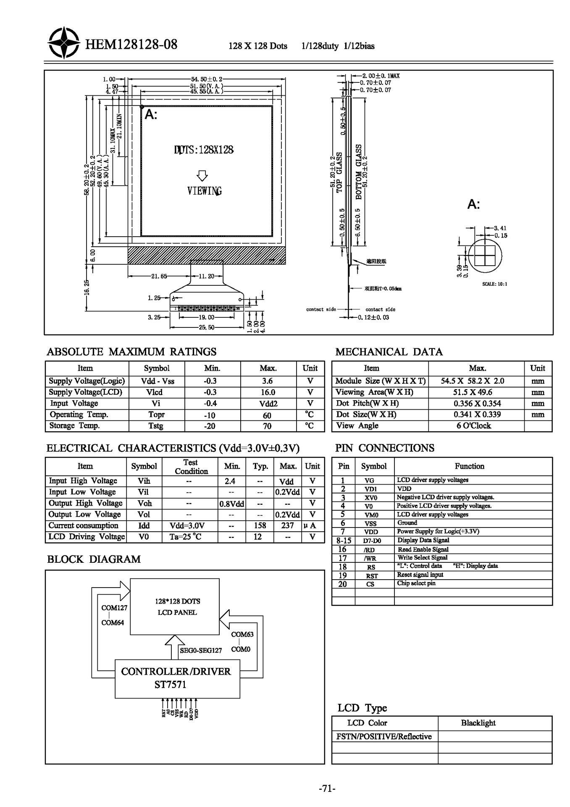

# HEM128128-08

## 参数

| 参数     | 属性               |
| -------- | ------------------ |
| 类型     | 4灰度STN点阵屏面板 |
| 分辨率   | 128x128x2          |
| 尺寸     | 54.5mm x 58mm      |
| 控制器   | ST7571             |
| 接口     | 8080 8-bit并口     |
| 有无背光 | 无                 |
| 工作电压 | 3.3V               |
| 备注     |                    |

## 正面

## 背面

## 测试

## 引脚定义

| 序号（FPC标） | 定义 |
| ------------- | ---- |
| 1             | VG   |
| 2             | VLCD |
| 3             | XV0  |
| 4             | V0   |
| 5             | VM0  |
| 6             | GND  |
| 7             | VCC  |
| 8             | D7   |
| 9             | D6   |
| 10            | D5   |
| 11            | D4   |
| 12            | D3   |
| 13            | D2   |
| 14            | D1   |
| 15            | D0   |
| 16            | RD   |
| 17            | WR   |
| 18            | A0   |
| 19            | RST  |
| 20            | CS   |

## 原厂资料

