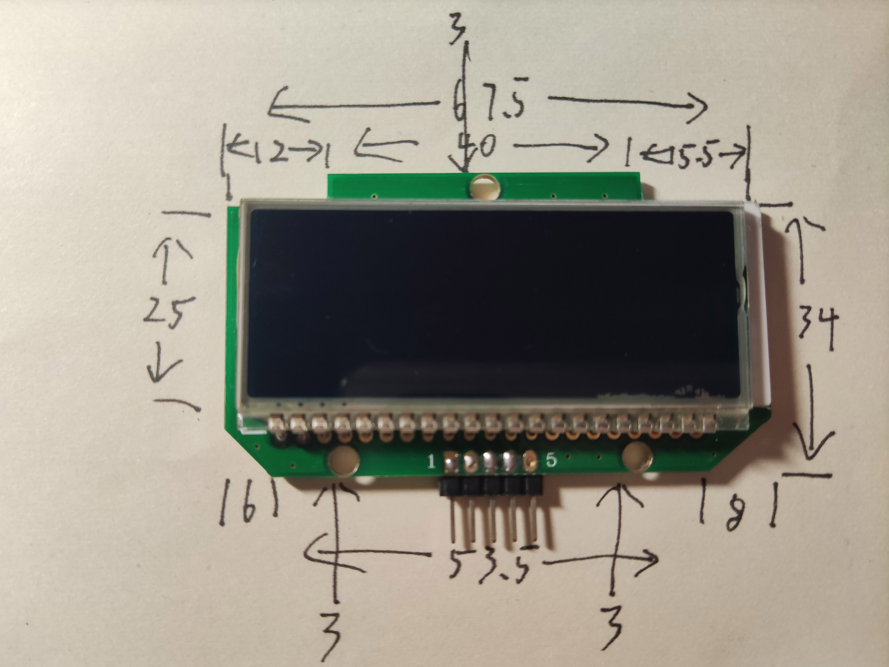
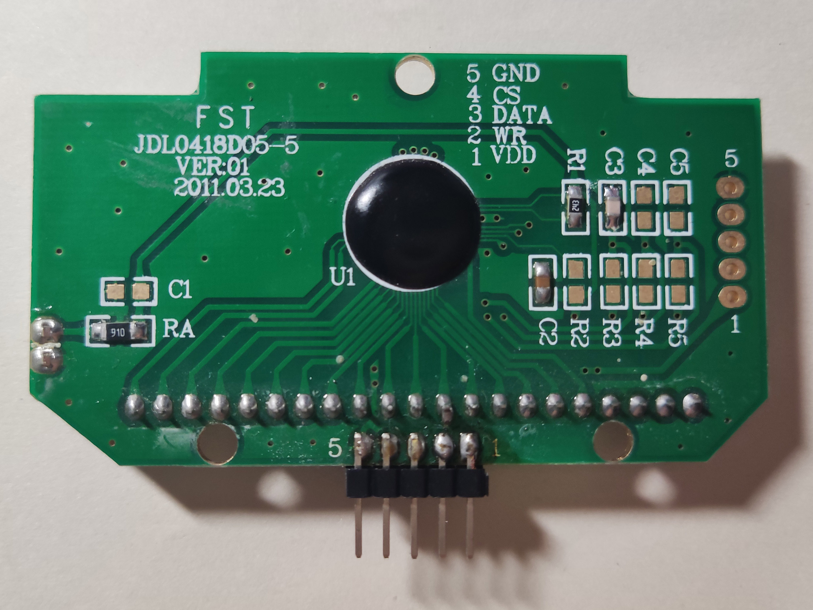
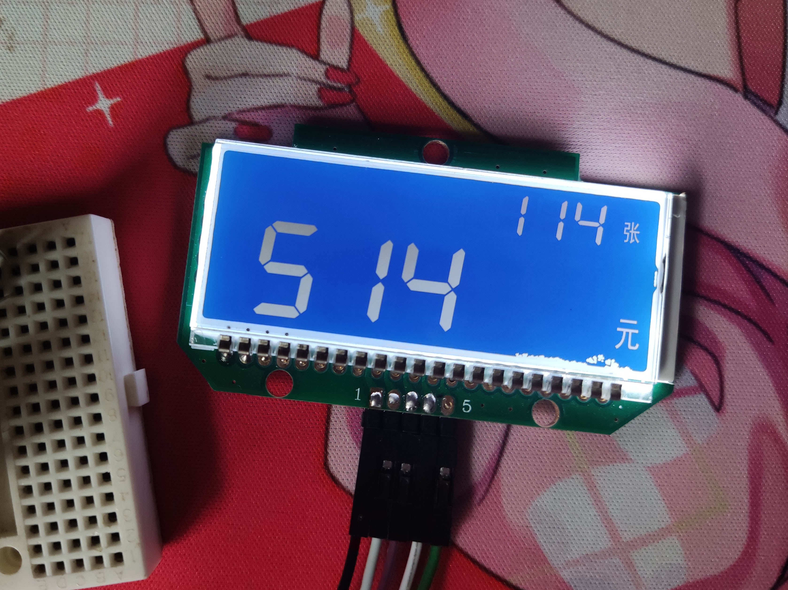
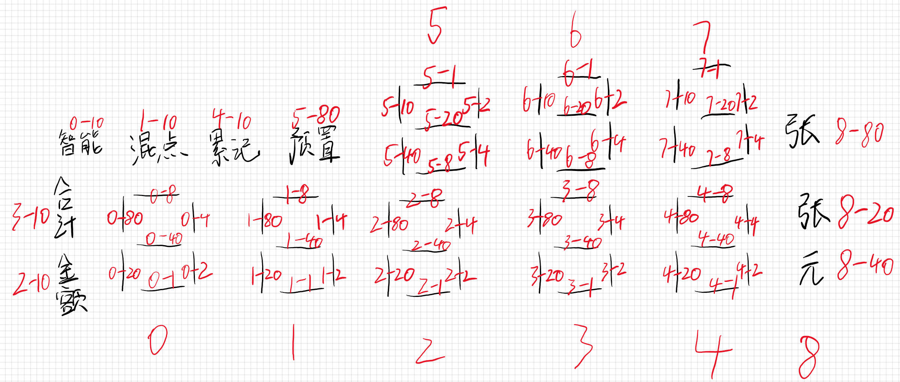

# JDL0418D05

## 参数

| 参数     | 属性                       |
| -------- | -------------------------- |
| 类型     | 单色段码 LCD 模组          |
| 分辨率   | -                          |
| 尺寸     | 67.5mm x 34mm（PCB最宽处） |
| 控制器   | HT1621                     |
| 接口     | 模拟 SPI                   |
| 有无背光 | 有                         |
| 工作电压 | 5V                         |
| 备注     |                            |

## 正面

## 背面

## 测试

## 引脚定义

| 序号（PCB标） | 定义 |
| ------------- | ---- |
| 1             | VCC  |
| 2             | WR   |
| 3             | DAT  |
| 4             | CS   |
| 5             | GND  |

## 码表

