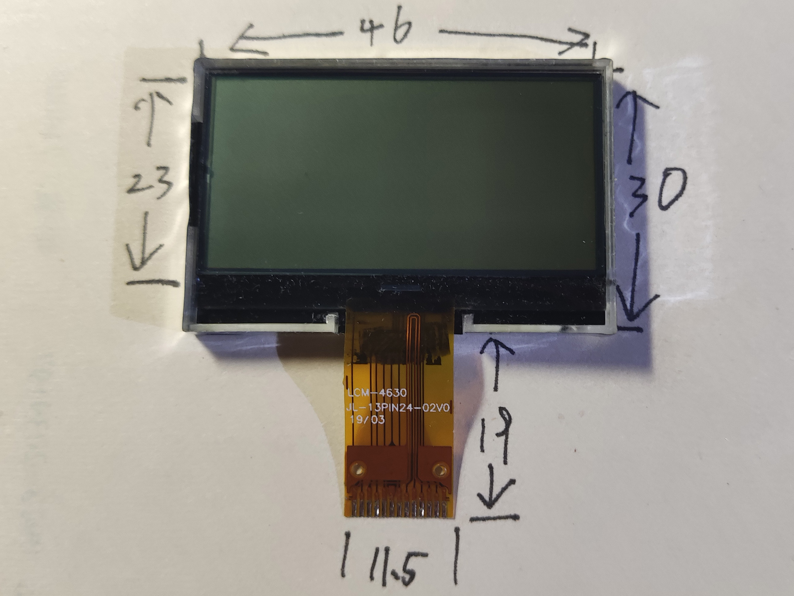
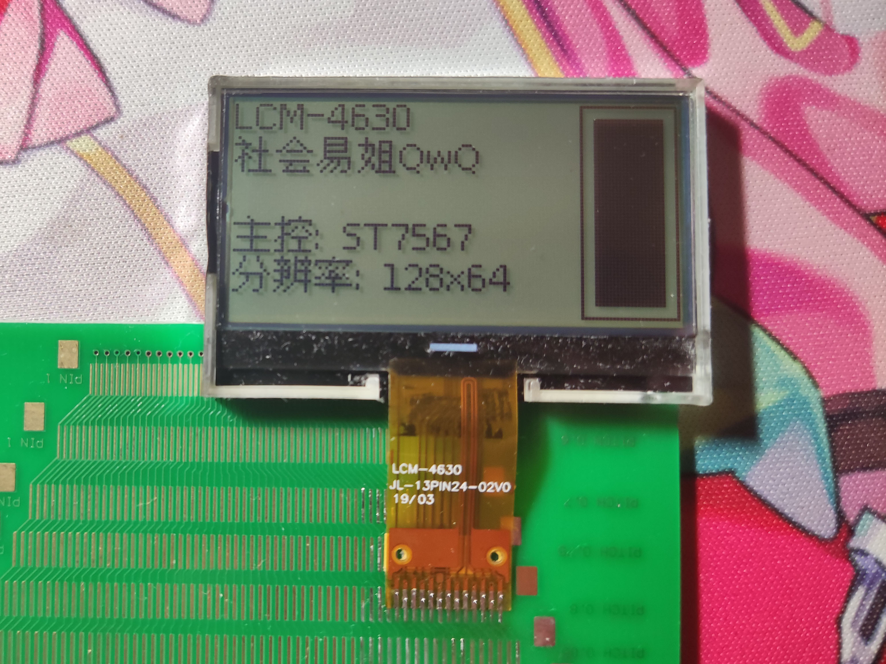

# LCM-4630

## 参数

| 参数     | 属性              |
| -------- | ----------------- |
| 类型     | 单色STN点阵屏面板 |
| 分辨率   | 128x64            |
| 尺寸     | 46mm x 30mm       |
| 控制器   | ST7567            |
| 接口     | 8-bit SPI         |
| 有无背光 | 无                |
| 工作电压 | 3.3V              |
| 备注     | -                 |

## 正面

## 背面

## 测试

## 引脚定义

| 序号（显示面从左至右） | 定义          |
| ---------------------- | ------------- |
| 1                      | to_13（加扰） |
| 2                      | N/C           |
| 3                      | VG            |
| 4                      | XV0           |
| 5                      | V0            |
| 6                      | GND           |
| 7                      | VCC           |
| 8                      | SDA           |
| 9                      | SCL           |
| 10                     | A0            |
| 11                     | RST           |
| 12                     | CS            |
| 13                     | to_1（加扰）  |