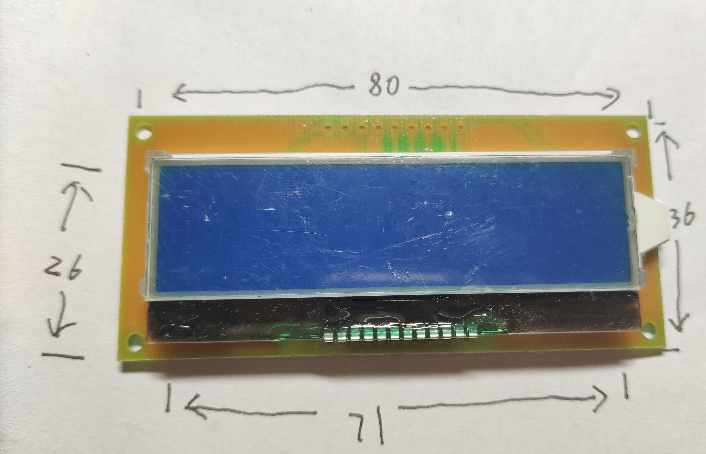
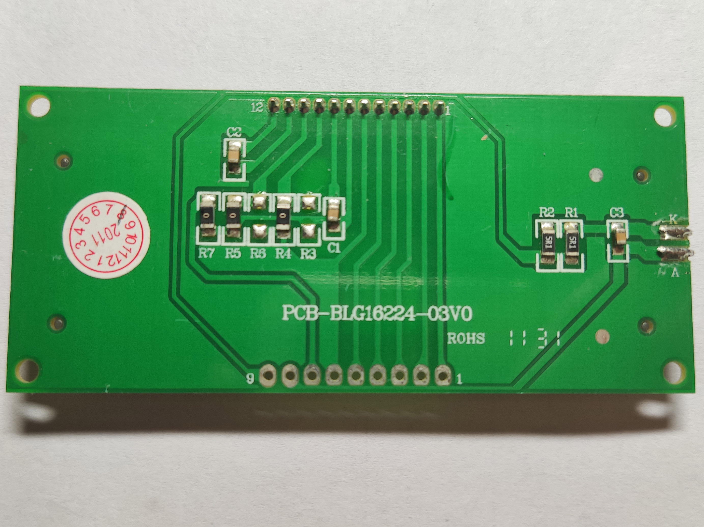
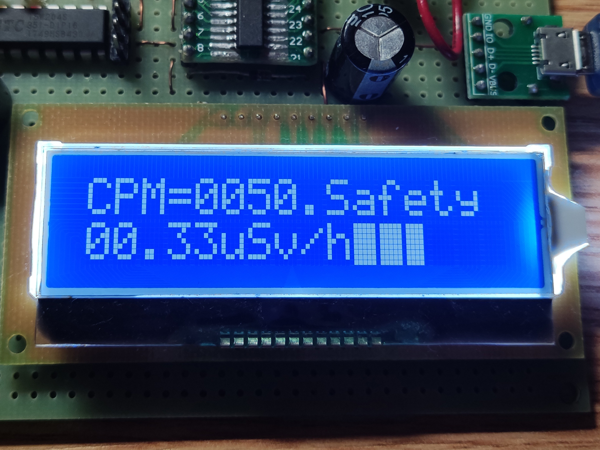

# PCB-BLG16224-03V0

## 参数：

| 参数     | 属性               |
| -------- | ------------------ |
| 类型     | STN字符屏模组      |
| 分辨率   | 16x2字符           |
| 尺寸     | 80x36（PCB）       |
| 控制器   | ST7032             |
| 接口     | 8-bit SPI I2C |
| 有无背光 | 有                 |
| 工作电压 | 3.3V               |
| 备注     | -                  |

## 正面：

## 背面：

## 测试：

## 接口选择：

| 接口模式  | R3   | R4   | R5   | R6   |
| --------- | ---- | ---- | ---- | ---- |
| 8-bit SPI |      | √    | √    |      |
| I2C       | √    |      |      | √    |

## 引脚定义：

| 序号（板标） | 定义 |
| ------------ | ---- |
| 1            | RST  |
| 2            | A0   |
| 3            | CS   |
| 4            | SCL  |
| 5            | SDA  |
| 6            | GND  |
| 7            | VCC  |
| 8            | LED+ |
| 9            | LED- |