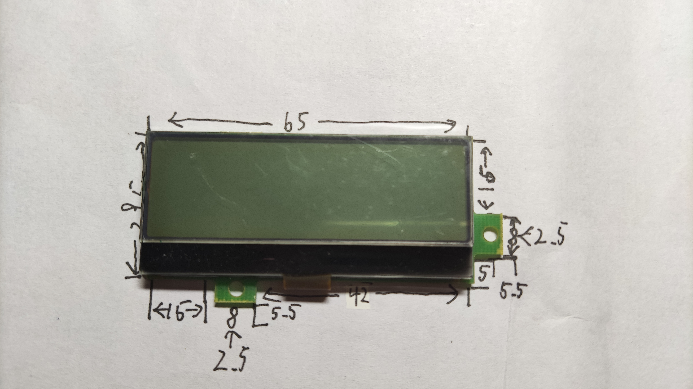
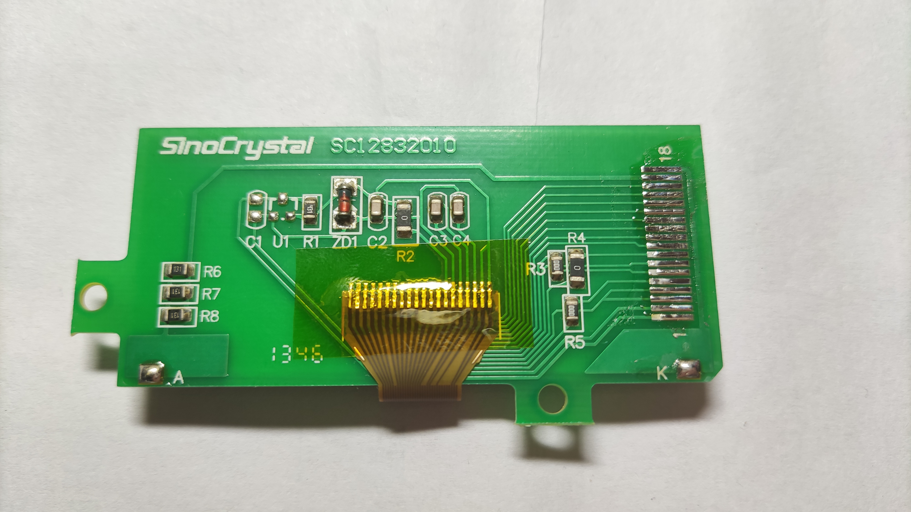
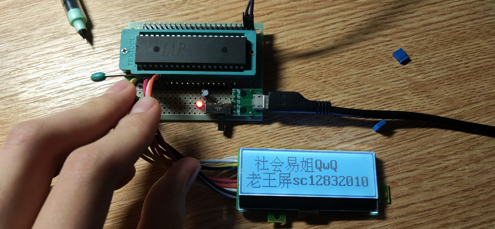
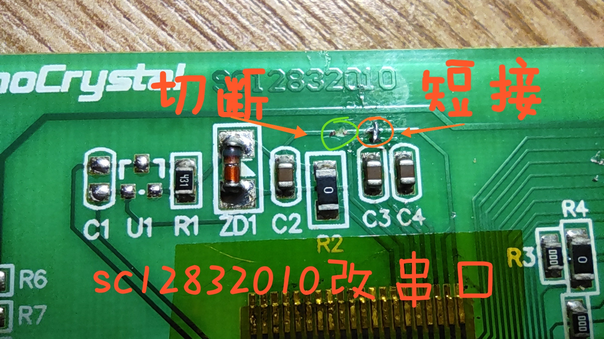

# SC12832010

## 参数：

| 参数     | 属性                              |
| -------- | --------------------------------- |
| 类型     | 单色STN点阵屏                     |
| 分辨率   | 128x32                            |
| 尺寸     | 70.5x34（最宽处）                 |
| 控制器   | ST7567                            |
| 接口     | 6800 8-bit并口（可改装8-bit SPI） |
| 有无背光 | 有                                |
| 工作电压 | 3.3V-5V                           |
| 备注     | -                                 |

## 正面：

## 背面：

## 测试：

## 改装串口：

## 引脚定义：

| 序号（板标） | 定义      |
| ------------ | --------- |
| 1            | VCC       |
| 2            | GND       |
| 3            | RST       |
| 4            | RST       |
| 5            | CS        |
| 6            | E         |
| 7            | R/W       |
| 8            | A0        |
| 9            | D0        |
| 10           | D1        |
| 11           | D2        |
| 12           | D3        |
| 13           | D4        |
| 14           | D5        |
| 15           | D6（SCL） |
| 16           | D7（SDA） |
| 17           | LED+      |
| 18           | LED-      |

