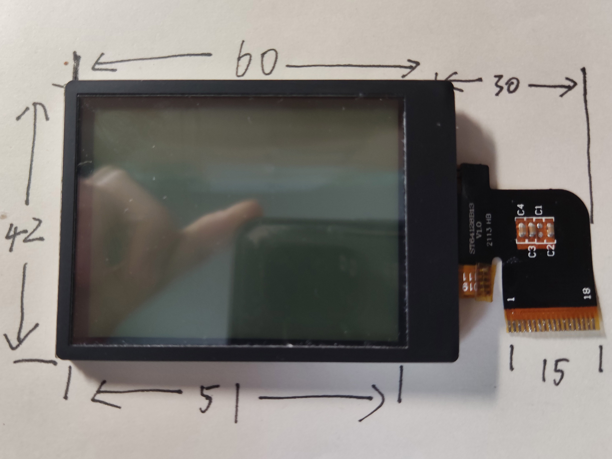
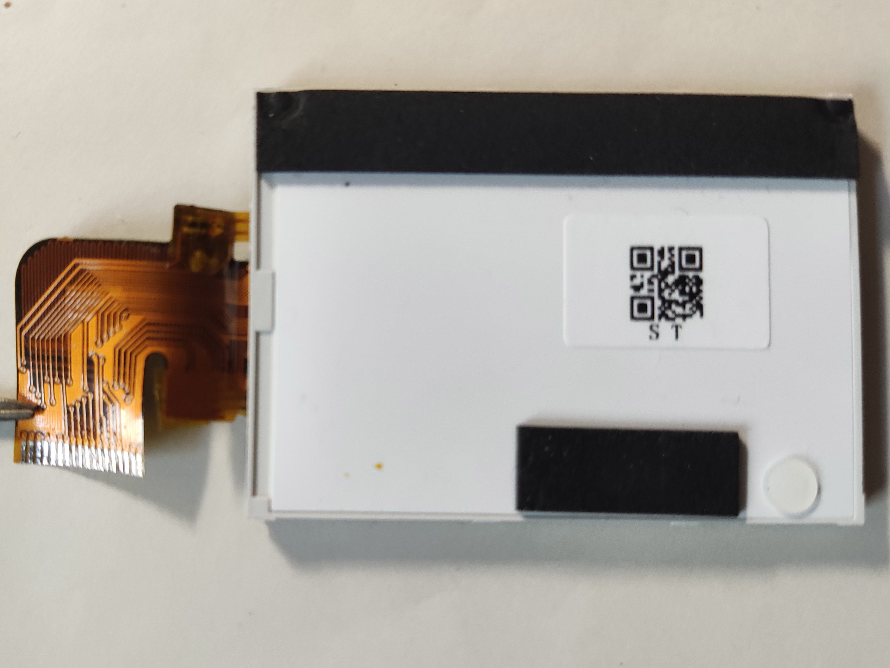
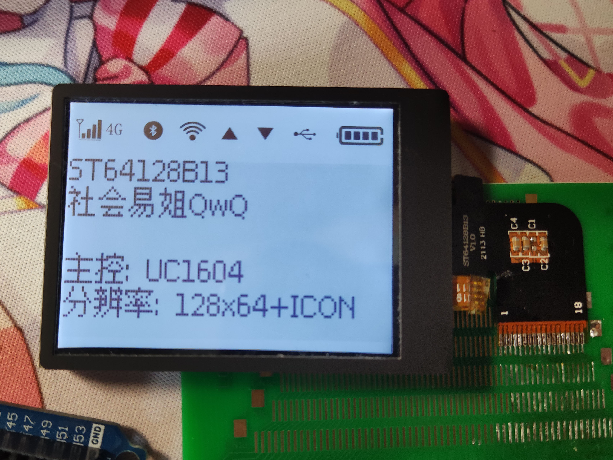
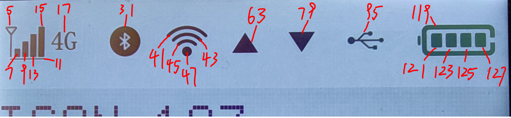

# ST64128B13

## 参数

| 参数     | 属性                                                         |
| -------- | ------------------------------------------------------------ |
| 类型     | 单色STN点阵屏面板                                            |
| 分辨率   | 128x64+ICON                                                  |
| 尺寸     | 60mm x 42mm                                                  |
| 控制器   | UC1604                                                       |
| 接口     | 8-bit SPI                                                    |
| 有无背光 | 有                                                           |
| 工作电压 | 3.3V                                                         |
| 备注     | 支持电阻触控 需设置垂直镜像 需设置水平镜像 列偏移需设置为64 |

## 正面

## 背面

## 测试

## 码表

## 引脚定义

| 序号（FPC标） | 定义         |
| ------------- | ------------ |
| 1             | LED-         |
| 2             | LED+         |
| 3             | GND          |
| 4             | VCC          |
| 5             | VCC          |
| 6             | to_7（加扰） |
| 7             | to_6（加扰） |
| 8             | CS           |
| 9             | RST          |
| 10            | SCL          |
| 11            | A0           |
| 12            | SDA          |
| 13            | N/C          |
| 14            | GND          |
| 15            | T_X1（触控） |
| 16            | T_Y1（触控） |
| 17            | T_X0（触控） |
| 18            | T_Y0（触控） |