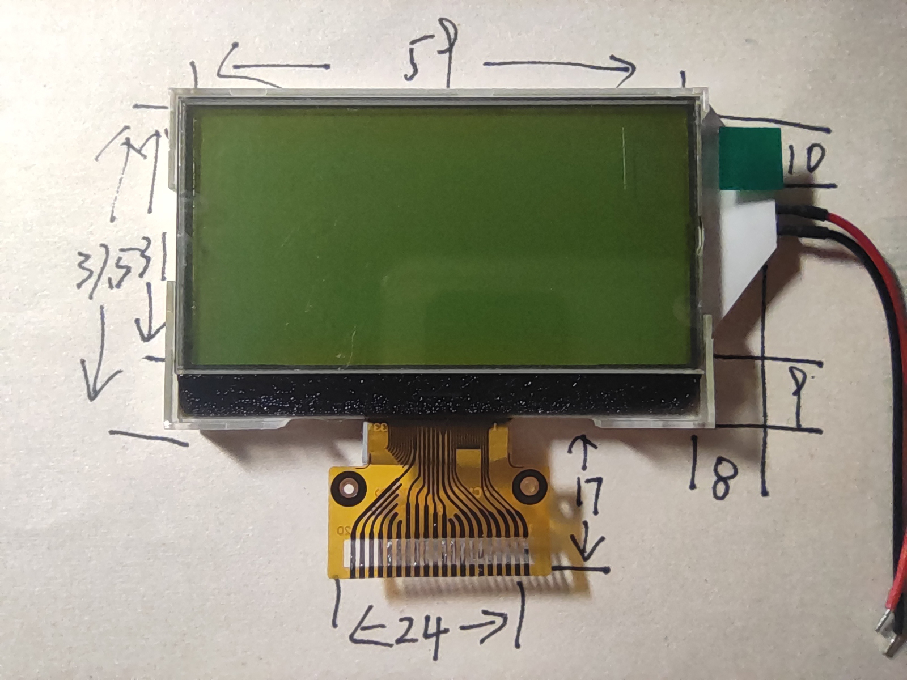
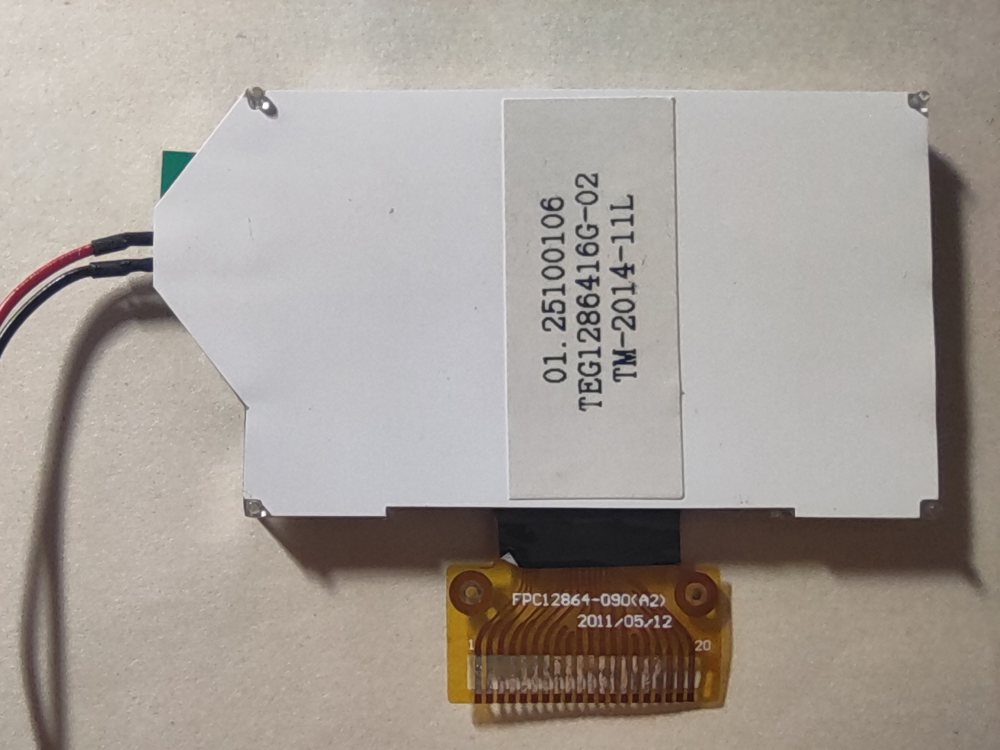
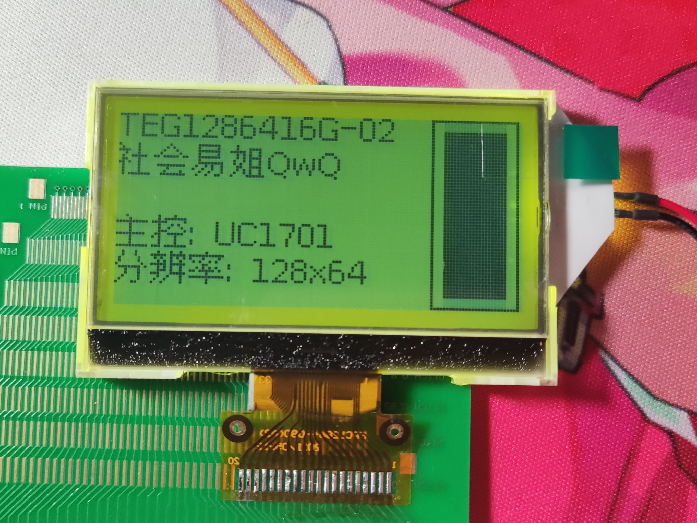

# TEG1286416G-02

## 参数

| 参数     | 属性                 |
| -------- | -------------------- |
| 类型     | 单色STN点阵屏面板    |
| 分辨率   | 128x64               |
| 尺寸     | 59mm x 37.5mm        |
| 控制器   | UC1701               |
| 接口     | 8-bit SPI            |
| 有无背光 | 有                   |
| 工作电压 | 3.3V                 |
| 备注     | 扫描起始行需设置为32 |

## 正面

## 背面

## 测试

## 引脚定义

| 序号（FPC标） | 定义 |
| ------------- | ---- |
| 1             | CS   |
| 2             | RST  |
| 3             | A0   |
| 4             | SCL  |
| 5             | SDA  |
| 6             | VCC  |
| 7             | GND  |
| 8             | N/C  |
| 9             | N/C  |
| 10            | VB0+ |
| 11            | VB0- |
| 12            | VB1- |
| 13            | VB1+ |
| 14            | VLCD |
| 15            | N/C  |
| 16            | N/C  |
| 17            | N/C  |
| 18            | N/C  |
| 19            | N/C  |
| 20            | GND  |