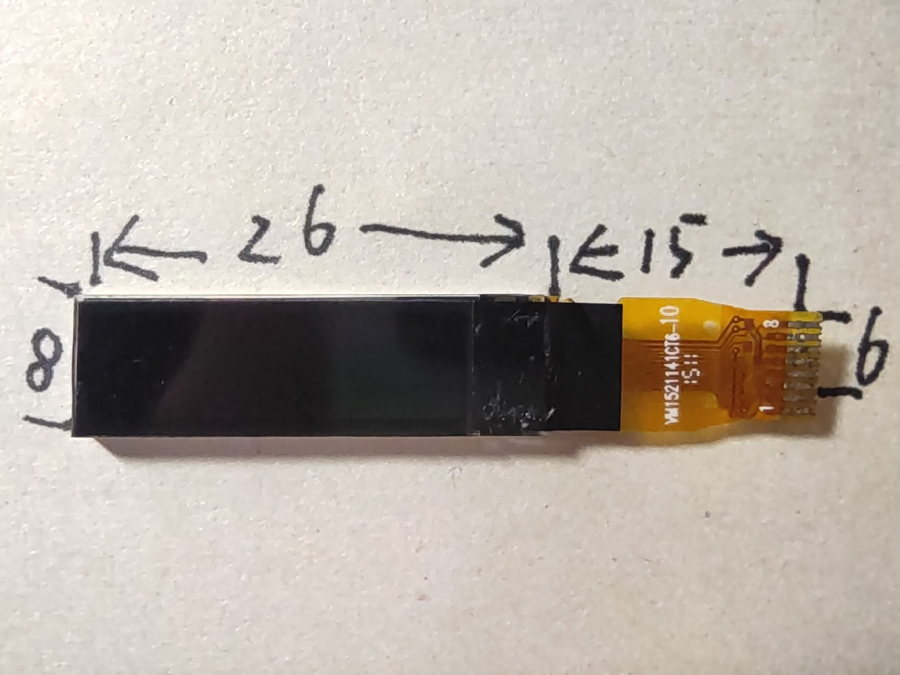
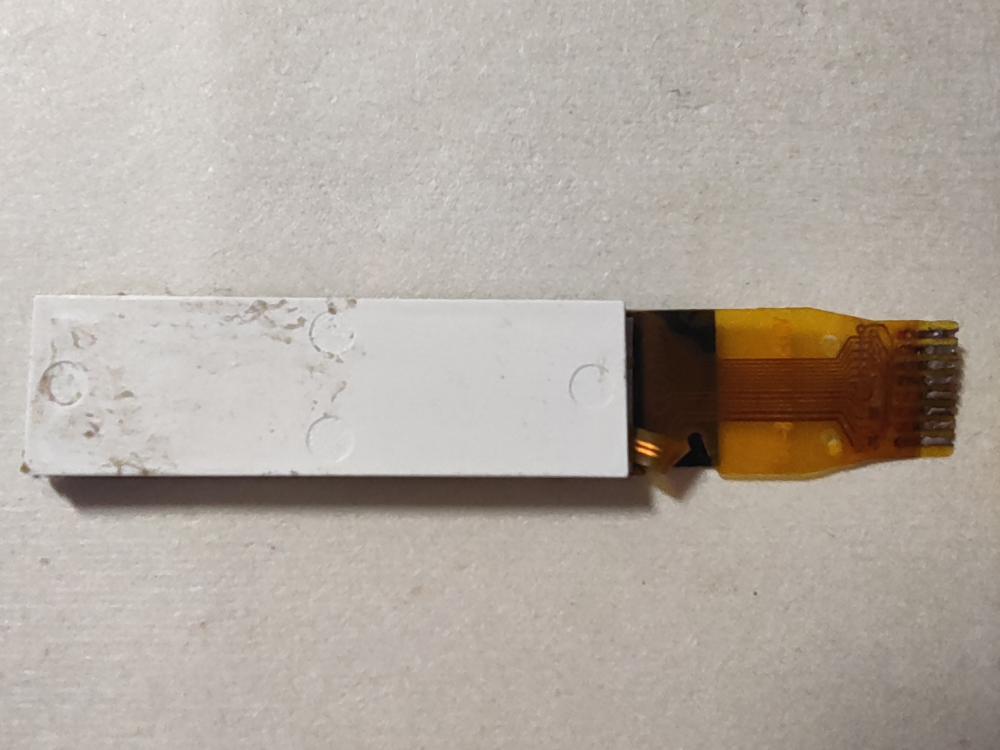
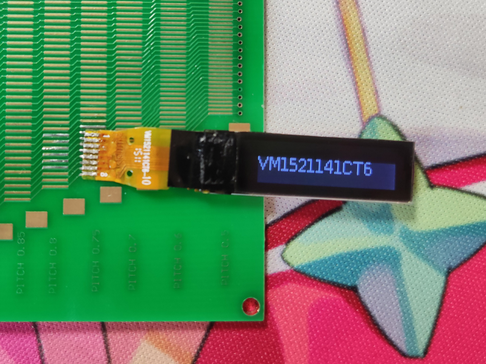

# VM1521141CT6

## 参数

| 参数     | 属性                                                       |
| -------- | ---------------------------------------------------------- |
| 类型     | 单色STN点阵屏面板                                          |
| 分辨率   | 96x16                                                      |
| 尺寸     | 26mm x 8mm                                                 |
| 控制器   | ST7539                                                     |
| 接口     | I2C                                                        |
| 有无背光 | 有                                                         |
| 工作电压 | 3.3V                                                       |
| 备注     | SA0=1 SA1=1 扫描终止行需要设为15，否则对比度很低 |

## 正面

## 背面

## 测试

## 引脚定义

| 序号（FPC标） | 定义 |
| ------------- | ---- |
| 1             | N/C  |
| 2             | LED- |
| 3             | LED+ |
| 4             | GND  |
| 5             | VCC  |
| 6             | RST  |
| 7             | SCL  |
| 8             | SDA  |