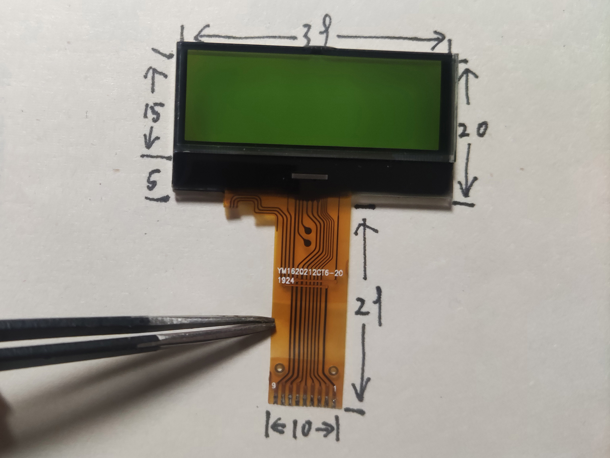
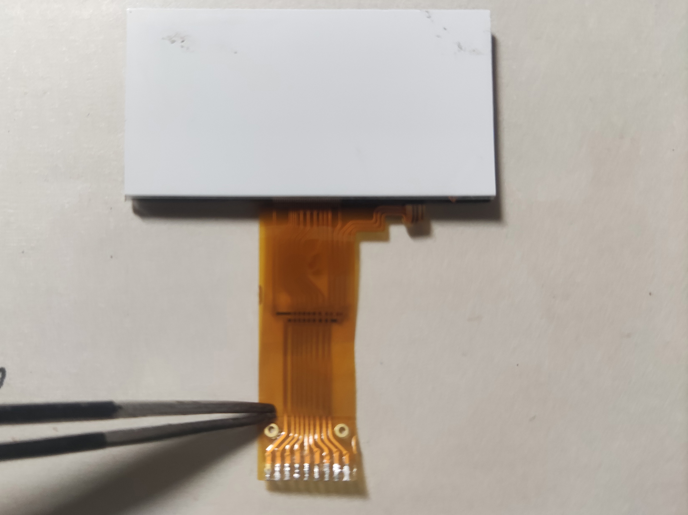
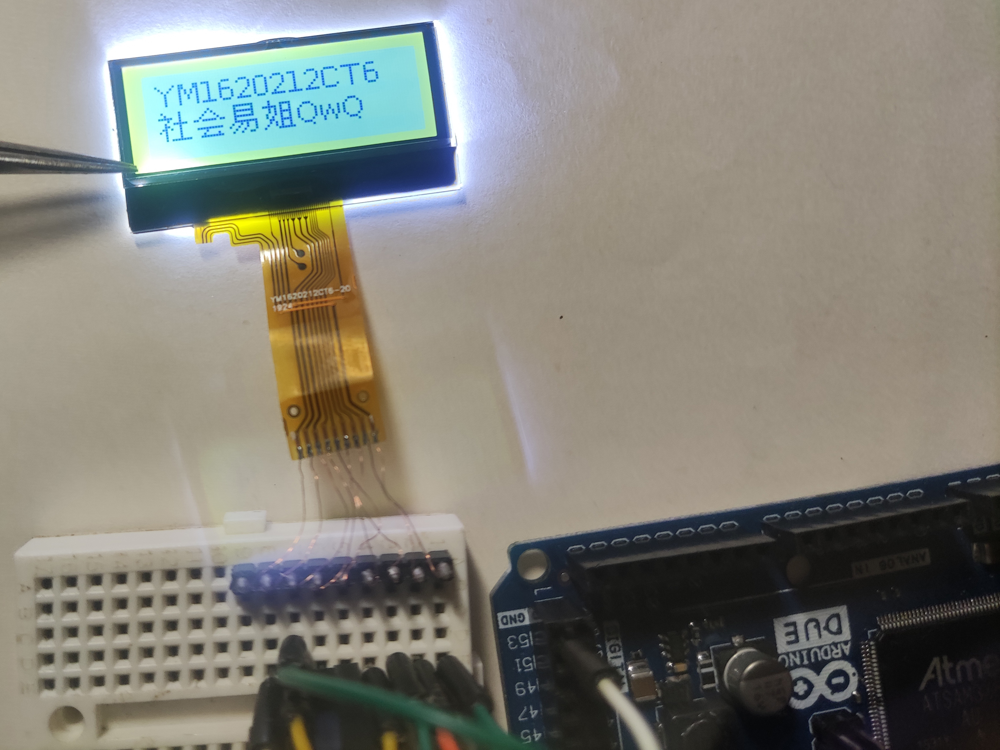

# YM1620212CT6

## 参数：

| 参数     | 属性                 |
| -------- | -------------------- |
| 类型     | 单色STN点阵屏面板    |
| 分辨率   | 128x32               |
| 尺寸     | 39x20                |
| 控制器   | ST7567               |
| 接口     | 8-bit SPI            |
| 有无背光 | 有                   |
| 工作电压 | 3.3V                 |
| 备注     | 需设置垂直及水平镜像 |

## 正面：

## 背面：

## 测试：

## 引脚定义：

| 序号（显示面从左至右） | 定义 |
| ---------------------- | ---- |
| 1                      | LED+ |
| 2                      | CS   |
| 3                      | RST  |
| 4                      | A0   |
| 5                      | SCL  |
| 6                      | SDA  |
| 7                      | VCC  |
| 8                      | GND  |
| 9                      | VG   |