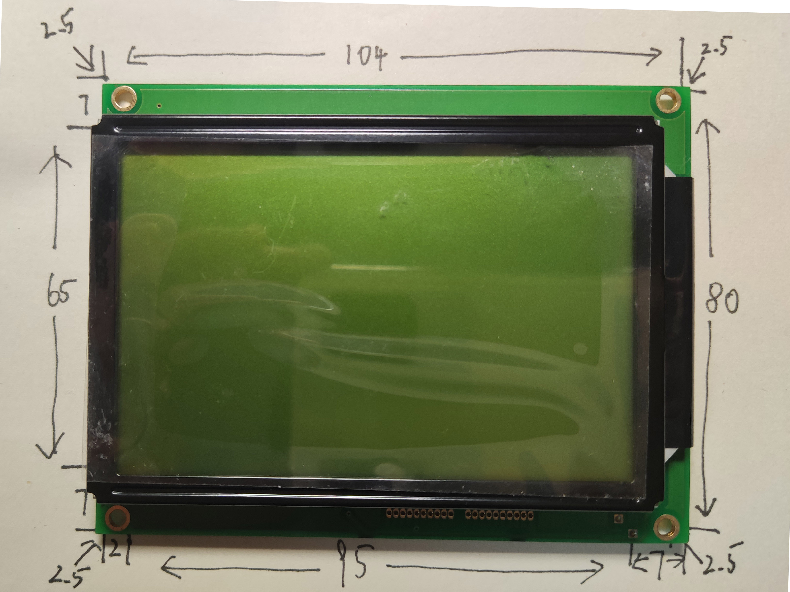
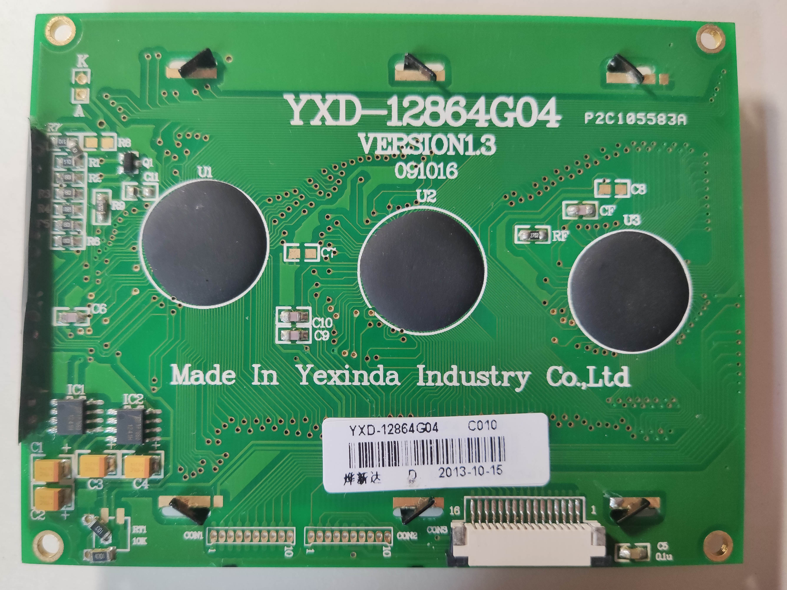
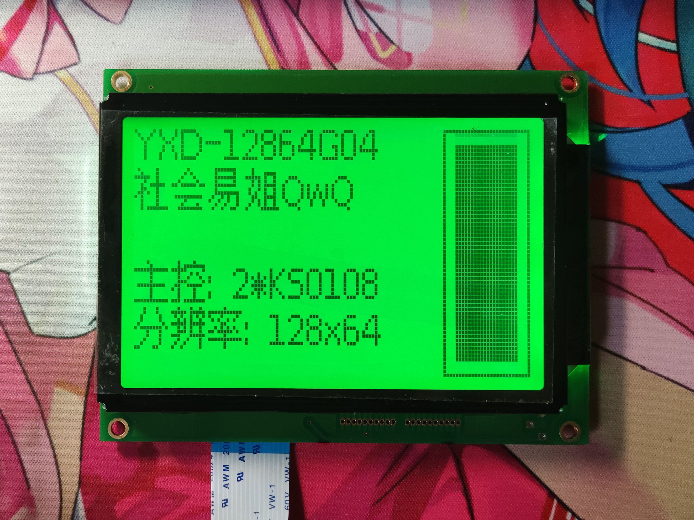

# YXD-12864G04

## 参数

| 参数     | 属性                      |
| -------- | ------------------------- |
| 类型     | 单色STN点阵屏模组         |
| 分辨率   | 128x64                    |
| 尺寸     | 104mm x 80mm（PCB最宽处） |
| 控制器   | 2 * KS0108                |
| 接口     | 6800 8-bit并口            |
| 有无背光 | 有                        |
| 工作电压 | 5V                        |
| 备注     |                           |

## 正面

## 背面

## 测试

## 引脚定义

| 序号（PCB标） | 定义 |
| ------------- | ---- |
| 1             | GND  |
| 2             | VCC  |
| 3             | A0   |
| 4             | R/W  |
| 5             | EN   |
| 6             | D7   |
| 7             | D6   |
| 8             | D5   |
| 9             | D4   |
| 10            | D3   |
| 11            | D2   |
| 12            | D1   |
| 13            | D0   |
| 14            | CS2  |
| 15            | CS1  |
| 16            | VCC  |
