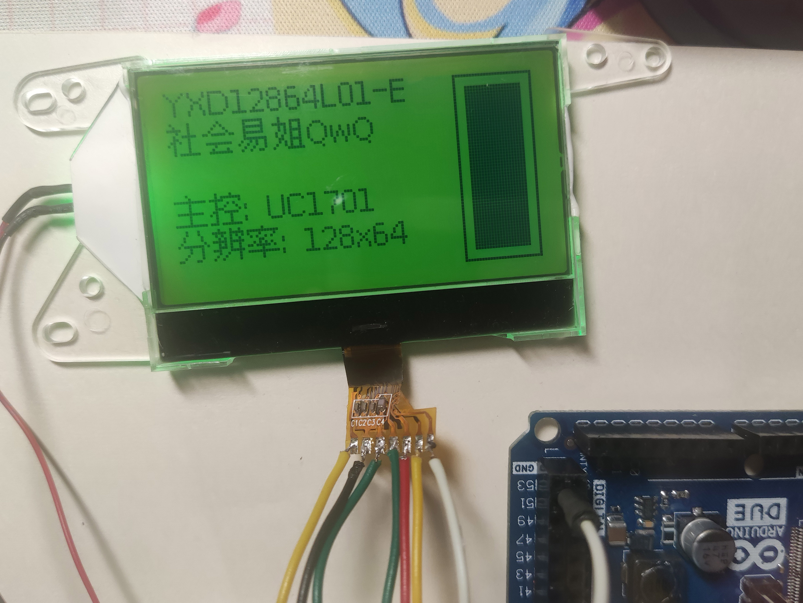

# YXD-12864L01-E

## 参数

| 参数     | 属性              |
| -------- | ----------------- |
| 类型     | 单色STN点阵屏面板 |
| 分辨率   | 128x64            |
| 尺寸     | 58mm x 40.5mm     |
| 控制器   | UC1701            |
| 接口     | 8-bit SPI         |
| 有无背光 | 有                |
| 工作电压 | 3.3V              |
| 备注     |                   |

## 正面

## 背面

## 测试

## 引脚定义

| 序号（显示面从左至右） | 定义 |
| ---------------------- | ---- |
| 1                      | VCC  |
| 2                      | GND  |
| 3                      | A0   |
| 4                      | CS   |
| 5                      | RST  |
| 6                      | SDA  |
| 7                      | SCL  |

## 原厂资料

[YXD-12864L01-E.pdf](YXD-12864L01-E.pdf)

